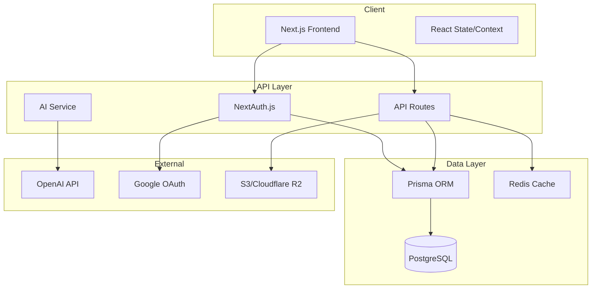

# Design Document: Elite Doc Generator Completion

## Overview

This design document outlines the architecture and implementation approach for completing Elite Doc Generator as a production-ready SaaS application. The system will integrate real AI services, user authentication, document persistence, and enhanced collaboration features while maintaining the existing premium UI/UX.

## Architecture

### High-Level Architecture



### Technology Stack

| Layer | Technology | Purpose |
|-------|------------|---------|
| Frontend | Next.js 15, React 18, TypeScript | UI and client-side logic |
| Styling | Tailwind CSS, Radix UI | Premium design system |
| Authentication | NextAuth.js v5 | User auth with OAuth |
| Database | PostgreSQL (Supabase/Neon) | Document and user storage |
| ORM | Prisma | Type-safe database access |
| AI | OpenAI SDK | Content generation |
| File Storage | Cloudflare R2 / S3 | Export file storage |
| Caching | Upstash Redis | Session and rate limiting |
| Deployment | Vercel | Hosting and edge functions |

## Components and Interfaces

### Authentication Components

```typescript
// lib/auth.ts - NextAuth configuration
interface AuthConfig {
  providers: [GoogleProvider, CredentialsProvider];
  callbacks: {
    session: (session, token) => SessionWithUser;
    jwt: (token, user) => JWTWithUser;
  };
  pages: {
    signIn: '/auth/signin';
    signUp: '/auth/signup';
    error: '/auth/error';
  };
}

// components/auth/auth-provider.tsx
interface AuthProviderProps {
  children: React.ReactNode;
}

// components/auth/sign-in-form.tsx
interface SignInFormProps {
  callbackUrl?: string;
  error?: string;
}

// components/auth/sign-up-form.tsx
interface SignUpFormProps {
  onSuccess: () => void;
}
```

### Document Service Interface

```typescript
// lib/services/document-service.ts
interface DocumentService {
  create(userId: string, data: CreateDocumentInput): Promise<Document>;
  update(id: string, data: UpdateDocumentInput): Promise<Document>;
  delete(id: string): Promise<void>;
  getById(id: string): Promise<Document | null>;
  getByUser(userId: string, options?: QueryOptions): Promise<Document[]>;
  search(userId: string, query: string): Promise<Document[]>;
  share(id: string, settings: ShareSettings): Promise<ShareLink>;
  revokeShare(id: string): Promise<void>;
}

interface CreateDocumentInput {
  title: string;
  templateId: string;
  content: DocumentContent;
  folderId?: string;
}

interface UpdateDocumentInput {
  title?: string;
  content?: DocumentContent;
  folderId?: string;
}

interface ShareSettings {
  permission: 'view' | 'edit';
  expiresAt?: Date;
}
```

### AI Service Interface

```typescript
// lib/services/ai-service.ts
interface AIService {
  generate(request: GenerateRequest): Promise<ReadableStream>;
  getUsage(userId: string): Promise<UsageStats>;
  checkLimit(userId: string): Promise<boolean>;
}

interface GenerateRequest {
  userId: string;
  templateId: string;
  mode: GenerationMode;
  content: string;
  context?: string;
}

type GenerationMode = 
  | 'executive-summary'
  | 'data-analysis'
  | 'recommendations'
  | 'policy-language'
  | 'consulting-tone'
  | 'make-professional'
  | 'more-concise'
  | 'add-data'
  | 'executive-tone';

interface UsageStats {
  generationsToday: number;
  generationsThisMonth: number;
  documentsCount: number;
  limit: number;
}
```

### Folder Service Interface

```typescript
// lib/services/folder-service.ts
interface FolderService {
  create(userId: string, name: string, parentId?: string): Promise<Folder>;
  rename(id: string, name: string): Promise<Folder>;
  delete(id: string): Promise<void>;
  getByUser(userId: string): Promise<FolderTree>;
  moveDocument(documentId: string, folderId: string): Promise<void>;
}
```

### Export Service Interface

```typescript
// lib/services/export-service.ts
interface ExportService {
  toPDF(document: Document, options: PDFOptions): Promise<Blob>;
  toPPTX(document: Document, options: PPTXOptions): Promise<Blob>;
  toDOCX(document: Document, options: DOCXOptions): Promise<Blob>;
  toHTML(document: Document): Promise<string>;
}

interface PDFOptions {
  quality: 'web' | 'print';
  pageSize: 'A4' | 'Letter';
  includeMetadata: boolean;
}
```

## Data Models

### Prisma Schema

```prisma
// prisma/schema.prisma

model User {
  id            String    @id @default(cuid())
  email         String    @unique
  name          String?
  image         String?
  passwordHash  String?
  emailVerified DateTime?
  createdAt     DateTime  @default(now())
  updatedAt     DateTime  @updatedAt
  
  accounts      Account[]
  sessions      Session[]
  documents     Document[]
  folders       Folder[]
  usage         Usage[]
  settings      UserSettings?
}

model Account {
  id                String  @id @default(cuid())
  userId            String
  type              String
  provider          String
  providerAccountId String
  refresh_token     String?
  access_token      String?
  expires_at        Int?
  token_type        String?
  scope             String?
  id_token          String?
  
  user User @relation(fields: [userId], references: [id], onDelete: Cascade)
  
  @@unique([provider, providerAccountId])
}

model Session {
  id           String   @id @default(cuid())
  sessionToken String   @unique
  userId       String
  expires      DateTime
  
  user User @relation(fields: [userId], references: [id], onDelete: Cascade)
}

model Document {
  id          String   @id @default(cuid())
  title       String
  templateId  String
  content     Json
  userId      String
  folderId    String?
  shareToken  String?  @unique
  sharePermission String?
  shareExpiresAt DateTime?
  createdAt   DateTime @default(now())
  updatedAt   DateTime @updatedAt
  
  user   User    @relation(fields: [userId], references: [id], onDelete: Cascade)
  folder Folder? @relation(fields: [folderId], references: [id])
  
  @@index([userId])
  @@index([folderId])
  @@index([shareToken])
}

model Folder {
  id        String   @id @default(cuid())
  name      String
  userId    String
  parentId  String?
  createdAt DateTime @default(now())
  updatedAt DateTime @updatedAt
  
  user      User       @relation(fields: [userId], references: [id], onDelete: Cascade)
  parent    Folder?    @relation("FolderHierarchy", fields: [parentId], references: [id])
  children  Folder[]   @relation("FolderHierarchy")
  documents Document[]
  
  @@index([userId])
  @@index([parentId])
}

model Usage {
  id        String   @id @default(cuid())
  userId    String
  type      String   // 'ai_generation', 'export', etc.
  count     Int      @default(1)
  date      DateTime @default(now())
  
  user User @relation(fields: [userId], references: [id], onDelete: Cascade)
  
  @@index([userId, date])
  @@index([userId, type])
}

model UserSettings {
  id              String  @id @default(cuid())
  userId          String  @unique
  defaultTemplate String?
  autoSave        Boolean @default(true)
  theme           String  @default("light")
  
  user User @relation(fields: [userId], references: [id], onDelete: Cascade)
}
```

### TypeScript Types

```typescript
// types/document.ts
interface DocumentContent {
  sections: Section[];
  metadata: DocumentMetadata;
}

interface Section {
  id: string;
  title: string;
  content: string;
  type: 'text' | 'chart' | 'diagram' | 'table';
  order: number;
}

interface DocumentMetadata {
  author?: string;
  createdAt: string;
  lastModified: string;
  version: number;
}

// types/user.ts
interface UserWithSettings {
  id: string;
  email: string;
  name: string | null;
  image: string | null;
  settings: UserSettings | null;
}
```


## Correctness Properties

*A property is a characteristic or behavior that should hold true across all valid executions of a system-essentially, a formal statement about what the system should do. Properties serve as the bridge between human-readable specifications and machine-verifiable correctness guarantees.*

### Property 1: Prompt Selection Consistency
*For any* template ID and generation mode combination, the AI service SHALL select and apply the corresponding prompt template from the prompt registry.
**Validates: Requirements 1.2, 1.5**

### Property 2: Error Message User-Friendliness
*For any* AI API error response, the service SHALL return a user-friendly message that does not expose internal error details or stack traces.
**Validates: Requirements 1.4**

### Property 3: User Registration Uniqueness
*For any* valid email address, registering twice with the same email SHALL result in an error on the second attempt, and only one user record SHALL exist.
**Validates: Requirements 2.2**

### Property 4: Authentication Correctness
*For any* user with valid credentials, authentication SHALL succeed and return a valid session. *For any* invalid credentials, authentication SHALL fail with an appropriate error.
**Validates: Requirements 2.3, 2.5**

### Property 5: Protected Route Enforcement
*For any* protected route in the application, an unauthenticated request SHALL be redirected to the sign-in page.
**Validates: Requirements 2.7**

### Property 6: Document ID Uniqueness
*For any* number of documents created, each document SHALL have a unique identifier that does not collide with any other document ID.
**Validates: Requirements 3.1**

### Property 7: Document Save/Load Round-Trip
*For any* valid document content, saving the document and then loading it SHALL return content equivalent to the original.
**Validates: Requirements 3.3, 3.5**

### Property 8: Document Deletion Completeness
*For any* deleted document, subsequent queries for that document SHALL return null or not found.
**Validates: Requirements 3.6**

### Property 9: Document Rename Persistence
*For any* document rename operation, loading the document SHALL return the new title.
**Validates: Requirements 3.7**

### Property 10: Folder Hierarchy Integrity
*For any* folder creation, the folder SHALL appear in the user's folder list and maintain proper parent-child relationships.
**Validates: Requirements 4.1**

### Property 11: Document Move Correctness
*For any* document moved to a folder, the document's folder reference SHALL update to the target folder ID.
**Validates: Requirements 4.2**

### Property 12: Search Result Relevance
*For any* search query, all returned documents SHALL contain the query string in either title or content.
**Validates: Requirements 4.3**

### Property 13: Template Filter Accuracy
*For any* template filter applied, all returned documents SHALL have the specified template type.
**Validates: Requirements 4.4**

### Property 14: Sort Order Correctness
*For any* sort criteria (date, name, template), the returned documents SHALL be ordered according to that criteria.
**Validates: Requirements 4.5**

### Property 15: Share Token Uniqueness
*For any* share operation, the generated share token SHALL be unique across all documents.
**Validates: Requirements 5.1**

### Property 16: Share Permission Enforcement
*For any* shared document with view-only permission, edit operations SHALL be rejected. *For any* shared document with edit permission, edit operations SHALL succeed.
**Validates: Requirements 5.2, 5.3**

### Property 17: Share Revocation Effectiveness
*For any* revoked share, accessing the document via the old share token SHALL fail.
**Validates: Requirements 5.4**

### Property 18: Export Content Completeness
*For any* document export (PDF, PPTX, DOCX), the exported file SHALL contain all sections from the source document.
**Validates: Requirements 6.1, 6.2, 6.3**

### Property 19: Profile Update Persistence
*For any* profile update, loading the user profile SHALL return the updated values.
**Validates: Requirements 7.2**

### Property 20: Password Change Security
*For any* password change attempt without correct current password, the operation SHALL fail and the password SHALL remain unchanged.
**Validates: Requirements 7.3**

### Property 21: Default Template Application
*For any* user with a default template set, new documents created without explicit template selection SHALL use the default template.
**Validates: Requirements 7.4**

### Property 22: Usage Statistics Accuracy
*For any* user, the reported document count SHALL equal the actual number of documents owned by that user, and AI generation count SHALL equal the sum of generation records.
**Validates: Requirements 8.1, 8.4**

### Property 23: Usage Limit Enforcement
*For any* user who has exceeded their usage limit, AI generation requests SHALL be rejected with an upgrade prompt.
**Validates: Requirements 8.3**

## Error Handling

### Error Categories

| Category | HTTP Status | User Message | Logging |
|----------|-------------|--------------|---------|
| Validation | 400 | Specific field errors | Debug |
| Authentication | 401 | "Please sign in to continue" | Info |
| Authorization | 403 | "You don't have permission" | Warn |
| Not Found | 404 | "Document not found" | Debug |
| Rate Limit | 429 | "Too many requests, please wait" | Warn |
| AI Service | 502 | "AI service temporarily unavailable" | Error |
| Server Error | 500 | "Something went wrong" | Error |

### Error Response Format

```typescript
interface ErrorResponse {
  error: {
    code: string;
    message: string;
    details?: Record<string, string[]>;
  };
}

// Example
{
  "error": {
    "code": "VALIDATION_ERROR",
    "message": "Invalid input",
    "details": {
      "email": ["Invalid email format"],
      "password": ["Must be at least 8 characters"]
    }
  }
}
```

### Retry Strategy

```typescript
interface RetryConfig {
  maxRetries: 3;
  baseDelay: 1000; // ms
  maxDelay: 10000; // ms
  retryableErrors: ['RATE_LIMIT', 'AI_SERVICE_ERROR', 'NETWORK_ERROR'];
}
```

## Testing Strategy

### Dual Testing Approach

This project uses both unit tests and property-based tests for comprehensive coverage:

- **Unit tests** verify specific examples, edge cases, and integration points
- **Property-based tests** verify universal properties that should hold across all inputs

### Testing Framework

- **Unit Testing**: Vitest with React Testing Library
- **Property-Based Testing**: fast-check library
- **E2E Testing**: Playwright (optional)

### Property-Based Testing Configuration

```typescript
// vitest.config.ts
import { defineConfig } from 'vitest/config';

export default defineConfig({
  test: {
    globals: true,
    environment: 'node',
    include: ['**/*.test.ts', '**/*.property.test.ts'],
  },
});
```

Each property-based test will:
- Run a minimum of 100 iterations
- Be tagged with the correctness property it implements
- Use format: `**Feature: elite-doc-completion, Property {number}: {property_text}**`

### Test Organization

```
__tests__/
├── unit/
│   ├── services/
│   │   ├── document-service.test.ts
│   │   ├── ai-service.test.ts
│   │   └── folder-service.test.ts
│   ├── api/
│   │   ├── documents.test.ts
│   │   └── auth.test.ts
│   └── components/
│       └── editor.test.ts
├── property/
│   ├── document.property.test.ts
│   ├── auth.property.test.ts
│   ├── search.property.test.ts
│   └── export.property.test.ts
└── e2e/
    ├── auth.spec.ts
    └── document-flow.spec.ts
```

### Key Test Scenarios

**Authentication Tests:**
- Valid registration creates user
- Duplicate email registration fails
- Valid credentials authenticate successfully
- Invalid credentials return appropriate error
- Protected routes redirect unauthenticated users

**Document Tests:**
- Create document assigns unique ID
- Save/load round-trip preserves content
- Delete removes document completely
- Rename updates title
- Search returns relevant results
- Filter returns correct template types

**AI Service Tests:**
- Correct prompt selected for template/mode
- Errors return user-friendly messages
- Rate limiting enforced
- Usage tracked accurately

**Export Tests:**
- PDF contains all sections
- PPTX has correct slide count
- DOCX preserves content

